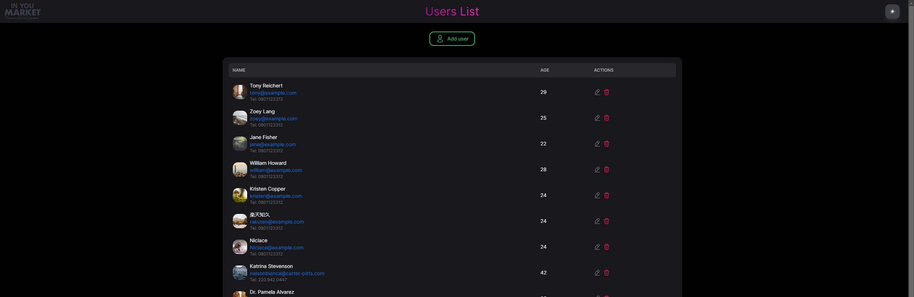
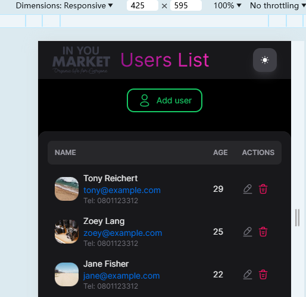
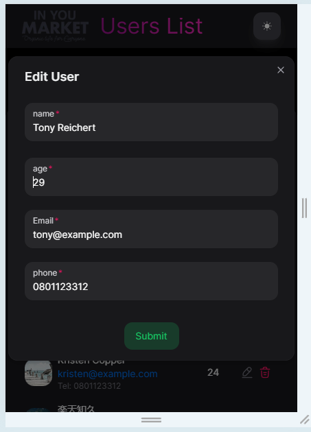

<div align="center">

<h1 align="center">NextUserList</h1>
A simple user mangement project for empoyment testing

Supported by React v18/Next v14/Redux/Nextui/react-hook-form

</div>

## Features

- Fetch random user avatars asynchronously from [dummy api](https://jsonplaceholder.typicode.com/users) through redux thunk action to avoid data delay.
- API request encapsulation and error handling to avoid global errors.
- Basic form validation logic.
- Auto-incrementing user IDs to prevent duplicate data.
- Support for mobile device display
- Distinguish between empty users and loading status
- husky + prettier + eslint + lint-staged to automatically format source code and check code quality
- light and dark themes.
- Strict global type constraints protect user data structure.

## How to develop

```shell
git clone https://github.com/lp601010/NextUserList.git

cd next-user-list

npm install
npm run prepare
npm run dev
```

## Online page

https://in-you-users.vercel.app/

## Screenshots




